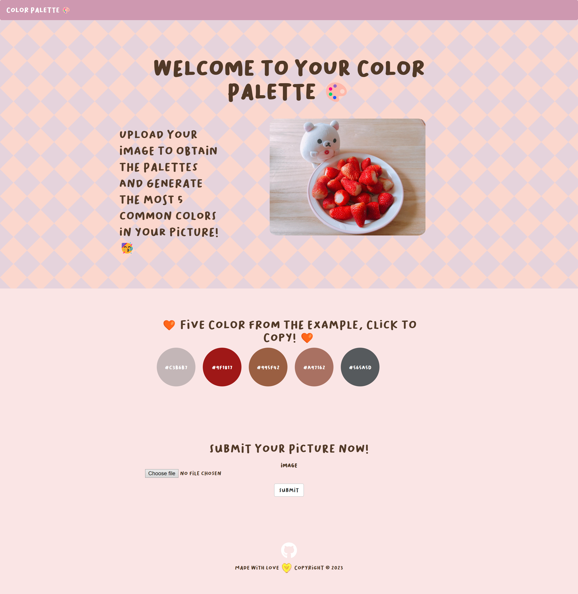

<h1 align="center">

Color Palette 🎨
  <br>
</h1>

<h4 align="center">A simple Flask app in getting color palatte from images.</h4>

<p align="center">

</p>

<p align="center">
  <a href="#key-features">Key Features</a> •
  <a href="#how-to-use">How To Use</a> •
  <a href="#download">Download</a> •
  <a href="#credits">Credits</a> •
  <a href="#related">Related</a> •
  <a href="#license">License</a>
</p>



## Key Features

* Get 5 colors from your images


## How To Use
Currently you could only clone this project and run the flask application locally but sooner or later, 
website version with more functionalities will come up.
```bash
# Clone this repository
$ git clone https://github.com/atris-Ctrl/colorPalette-master.git

# Go into the repository
$ cd colorPalette-master

# Install dependencies
$ pip install -r requirements.txt
```


## Credits

This software uses the following open source packages:

- [Electron](http://electron.atom.io/)
- [Node.js](https://nodejs.org/)
- [Marked - a markdown parser](https://github.com/chjj/marked)
- [showdown](http://showdownjs.github.io/showdown/)
- [CodeMirror](http://codemirror.net/)
- Emojis are taken from [here](https://github.com/arvida/emoji-cheat-sheet.com)
- [highlight.js](https://highlightjs.org/)

## Related

[markdownify-web](https://github.com/amitmerchant1990/markdownify-web) - Web version of Markdownify


## License

MIT

---

> GitHub [@atris-Ctrl](https://github.com/amitmerchant1990)
